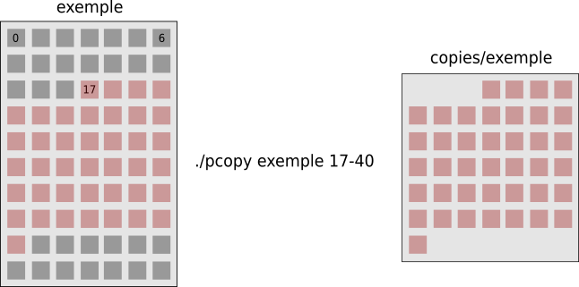

# TP0 - Copie partielle

L'objectif du TP0 est de développer l'utilitaire `pcopy` capable de copier une partie délimitée d'un ou plusieurs fichiers.

## Description de l'outil

```
pcopy [<PATH> <OFFSET>-<BYTES>]...
```

`pcopy` va parcourir les paramètres d'appel et extraire en couple les arguments suivants (dans cet ordre),
- `PATH` un chemin identifiant le fichier à copier,
- les valeurs de `OFFSET` et `BYTES` deux entiers positifs ou nuls qui représentent, respectivement,
  - l'octet à partir duquel la copie commence,
  - le nombre d'octets à copier.

Une fois ces arguments lus, l'utilitaire `pcopy` va procéder ainsi,
- il va créer un répertoire nommé `copies` dans le répertoire courant,
- pour chaque couple `PATH`, `OFFSET-BYTES` lu,
  - il va créer un fichier dans le répertoire `copies`, avec les permissions d'accès `644`, qui porte le même nom que le fichier identifié par le chemin `PATH`,
  - à partir de l'octet `OFFSET` inclusivement, il va copier au plus `BYTES` octets (ou jusqu'à la fin du fichier) du fichier identifié par `PATH`, dans le nouveau fichier fraichement créé dans `copies`.

Si tout s'est déroulé sans erreur, à la fin des copies, l'utilitaire `pcopy` affiche le nombre total d'octets copiés et se termine en retournant la valeur `0`.

<p>

<details>

<summary>Illustration</summary>



</details>

</p>

<p>

<p>

<details>

<summary>Exemple 1</summary>

<pre>
<b>groot@iam:~/$</b> ls
hello   pcopy
<b>groot@iam:~/$</b> cat hello
Bonjour le monde!
<b>groot@iam:~/$</b> wc hello 
 1  3 18 hello
<b>groot@iam:~/$</b> ./pcopy hello 12-6
6
<b>groot@iam:~/$</b> ls
copies  hello  pcopy
<b>groot@iam:~/$</b> ls copies
hello
<b>groot@iam:~/$</b> cat copies/hello 
onde!
<b>groot@iam:~/$</b> wc copies/hello 
1 1 6 copies/hello
</pre>

</details>

</p>

<p>

<details>

<summary>Exemple 2</summary>

<pre>
<b>groot@iam:~/$</b> ls
other  pcopy
<b>groot@iam:~/$</b> ls other/
bonjour.java
<b>groot@iam:~/$</b> cat other/bonjour.java 
class Simple{
    public static void main(String args[]){
    System.out.println("Hello Java");
    }
}
<b>groot@iam:~/$</b> wc other/bonjour.java 
  5  11 104 other/bonjour.java
<b>groot@iam:~/$</b> ./pcopy other/bonjour.java 50-70
54
<b>groot@iam:~/$</b> ls
copies  other  pcopy
<b>groot@iam:~/$</b> ls copies/
bonjour.java
<b>groot@iam:~/$</b> cat copies/bonjour.java 
rgs[]){
    System.out.println("Hello Java");
    }
}
<b>groot@iam:~/$</b> wc copies/bonjour.java 
 4  5 54 copies/bonjour.java
</pre>

</details>

</p>

<p>

<details>

<summary>Exemple 3</summary>

<pre>
<b>groot@iam:~/$</b> ls
hello  other  pcopy
<b>groot@iam:~/$</b> ls other/
bonjour.java
<b>groot@iam:~/$</b> cat hello
Bonjour le monde!
<b>groot@iam:~/$</b> wc hello 
 1  3 18 hello
<b>groot@iam:~/$</b> cat other/bonjour.java 
class Simple{
    public static void main(String args[]){
    System.out.println("Hello Java");
    }
}
<b>groot@iam:~/$</b> wc other/bonjour.java 
  5  11 104 other/bonjour.java
<b>groot@iam:~/$</b> ./pcopy hello 12-6 other/bonjour.java 50-43
49
<b>groot@iam:~/$</b> ls
copies  hello  other  pcopy
<b>groot@iam:~/$</b> ls copies/
bonjour.java  hello
<b>groot@iam:~/$</b> cat copies/hello 
onde!
<b>groot@iam:~/$</b> wc copies/hello 
1 1 6 copies/hello
<b>groot@iam:~/$</b> cat copies/bonjour.java 
rgs[]){
    System.out.println("Hello Java"<b>groot@iam:~/$</b> wc copies/bonjour.java 
 1  3 43 copies/bonjour.java
</pre>

</details>

</p>

### Valeur de retour

`pcopy` retourne `0` en cas de succès et `1` en cas d'échec. 

## Directives d'implémentation

Vous devez développer le programme en C.
Le fichier source doit s'appeler `pcopy.c` et être à la racine du dépôt.
Vu la taille du projet, tout doit rentrer dans ce seul fichier source.

Pour la réalisation du TP, vous devez respecter les directives suivantes.

### Appels système

- **Vous devez utiliser l'appel système** `open` pour toute ouverture de fichier (que ça soit en lecture ou en écriture).
  - Pensez au **ou binaire** pour combiner vos _flags_.
- Vous utiliserez les appels système `close`, `read`, `write` et `lseek` pour manipuler les fichiers et `mkdir` pour créer le répertoire `copies`.
- Noubliez pas de traiter les erreurs de chaque appel système.

### Précisions

- Vous pouvez supposer que les arguments avec lesquels l'utilitaire `pcopy` sera testé sont valides. C'est à dire,
  - `PATH` est un chemin vers un fichier qui existe et est lisible,
  - `OFFSET` et `BYTES` sont deux entiers positifs ou nuls, séparés par un tiret (`-`).
- Si le répertoire `copies` existe dans le répertoire courant, il sera utilisé directement par `pcopy`.
- Le fichier identifié par le chemin `PATH` doit être ouvert en lecture seule.
- Si un fichier portant le nom du fichier à copié existe déjà dans le répertoire `copies`, il sera ecrasé par `pcopy`. 
- Pour un couple `PATH`, `OFFSET-BYTES`, si la position `OFFSET` dépasse la taille du fichier identifié par `PATH`, `pcopy` s'arrête et retourne la valeur `1`. **Remarque.** Tous les fichiers qui venaient avant doivent être traités.
- Vous pouvez assumer que la taille maximale qui sera copiée à partir d'un fichier ne dépassera pas `4096` octets.
- Comme le TP n'est pas si gros (de l'ordre de grandeur d'une centaines de lignes), il est attendu un effort important sur le soin du code et la gestion des cas d'erreurs.

## Acceptation et remise du TP

### Acceptation

Accepter le TP manuellement en faisant les trois actions directement:

* Cloner (fork) ce dépôt sur le gitlab départemental.
* Le rendre privé : dans `Settings` → `General` → `Visibility` → `Project visibility` → `Private`.
* Ajouter l'utilisateur `@abdenbi_m` comme mainteneur (oui, j'ai besoin de ce niveau de droits) : dans `Settings` → `Members` → `Invite member` → `@abdenbi_m`.
* ⚠️ Mal effectuer ces étapes vous expose à des pénalités importantes.


### Remise

La remise s'effectue simplement en poussant votre code sur la branche `master` de votre dépôt gitlab privé.
Seule la dernière version disponible avant le **dimanche 3 octobre à 23h55** sera considérée pour la correction.


### Intégration continue

Vouz pouvez compiler avec `make` (le `Makefile` est fourni).

Vous pouvez vous familiariser avec le contenu du dépôt, en étudiant chacun des fichiers (`README.md`, `Makefile`, `check.bats`, `.gitlab-ci.yml`, etc.).

⚠️ À priori, il n'y a pas de raison de modifier un autre fichier du dépôt.
Si vous en avez besoin, ou si vous trouvez des bogues ou problèmes dans les autres fichiers, merci de me contacter.

Le système d'intégration continue vérifie votre TP à chaque `push`.
Vous pouvez vérifier localement avec `make check` (l'utilitaire `bats` entre autres est nécessaire).

Les tests fournis ne couvrent que les cas d'utilisation de base, en particulier ceux présentés ici.
Il est **fortement suggéré** d'ajouter vos propres tests dans [local.bats](local.bats) et de les pousser pour que l’intégration continue les prenne en compte.
Ils sont dans un job distincts pour avoir une meilleure vue de l'état du projet.

❤ En cas de problème pour exécuter les tests sur votre machine, merci de 1. lire la documentation présente ici et 2. poser vos questions en classe ou sur [Mattermost](https://mattermost.info.uqam.ca/forum/channels/inf3173).
Attention toutefois à ne pas fuiter de l’information relative à votre solution (conception, morceaux de code, etc.)

### Barème et critères de correction

Le barème utilisé est le suivant

* 50%: pour le jeu de test public fourni dans le sujet (voir section intégration).
* 50%: pour un jeu de test privé exécuté lors de la correction. Ces tests pourront être plus gros, difficiles et/ou impliquer des cas limites d'utilisation (afin de vérifier l'exactitude et la robustesse de votre code).
* Des pénalités pour des bogues spécifiques et des défauts dans le code source du programme, ce qui inclut, mais sans s'y limiter l'exactitude, la robustesse, la lisibilité, la simplicité, la conception, les commentaires, etc.
* Note: consultez la section suivante pour des exemples de pénalités et éventuellement des conseils pour les éviter.

## Mentions supplémentaires importantes

⚠️ **Intégrité académique**
Rendre public votre dépôt personnel ou votre code ici ou ailleurs ; ou faire des MR contenant votre code vers ce dépôt principal (ou vers tout autre dépôt accessible) sera considéré comme du **plagiat**.

⚠️ Attention, vérifier **=/=** valider.
Ce n'est pas parce que les tests passent chez vous ou ailleurs ou que vous avez une pastille verte sur gitlab que votre TP est valide et vaut 100%.
Par contre, si des tests échouent quelque part, c'est généralement un bon indicateur de problèmes dans votre code.

⚠️ Si votre programme **ne compile pas** ou **ne passe aucun test public**, une note de **0 sera automatiquement attribuée**, et cela indépendamment de la qualité de code source ou de la quantité de travail mise estimée.
Il est ultimement de votre responsabilité de tester et valider votre programme.

Pour les tests, autant publics que privés, les résultats qui font foi sont, ceux exécutés sur java.labunix.uqam.ca et/ou sur l'instance gitlab.info.uqam.ca (au choix du correcteur). Si un test réussi presque ou de temps en temps, il est considéré comme échoué (sauf rares exceptions).


Quelques exemples de bogues fréquents dans les copies TP de INF3173 qui causent une perte de points, en plus d'être responsable de tests échoués:

* Utilisation de variables ou de mémoire non initialisés (comportement indéterminé).
* Mauvaise vérification des cas d'erreur des fonctions et appels système (souvent comportement indéterminé si le programme continue comme si de rien n'était)
* Utilisation de valeurs numériques arbitraires (*magic number*) qui cause des comportements erronés si ces valeurs sont dépassées (souvent dans les tailles de tableau).
* Code inutilement compliqué, donc fragile dans des cas plus ou moins limites.


Quelques exemples de pénalités additionnelles:

* Vous faites une MR sur le dépôt public avec votre code privé : à partir de -10%
* Vous demandez à être membre du dépôt public : -5%
* Si vous critiquez à tort l'infrastructure de test : -10%
* Vous modifiez un fichier autre que le fichier source ou `local.bats` (ou en créez un) sans avoir l’autorisation : à partir de -10%
* Votre dépôt n'est pas un fork de celui-ci : -100%
* Votre dépôt n'est pas privé : -100%
* L'utilisateur `@abdenbi_m` n'est pas mainteneur : -100%
* Votre dépôt n'est pas hébergé sur le gitlab départemental : -100%
* Vous faites une remise par courriel : -100%
* Vous utilisez « mais chez-moi ça marche » (ou une variante) comme argument : -100%
* Si je trouve des morceaux de votre code sur le net (même si vous en êtes l'auteur) : -100%
